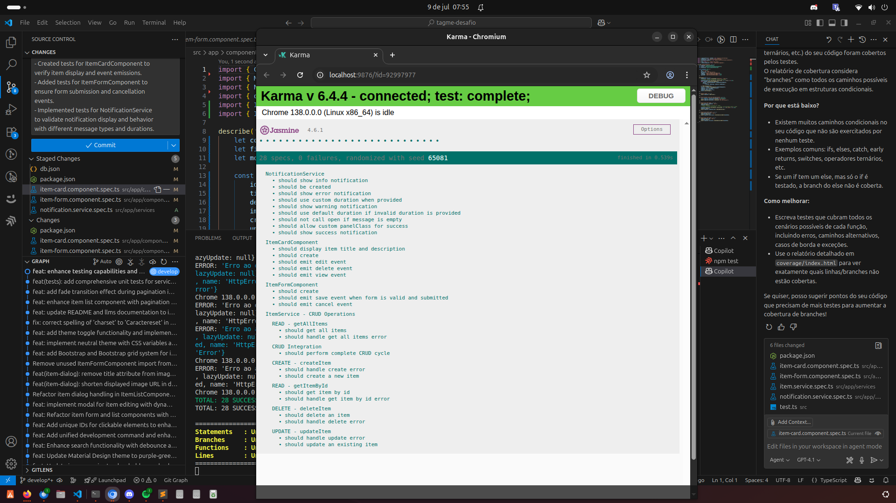

src/app/
npm run json-server    # Iniciar API (porta 3000)
npm run start:dev      # Ambos simultaneamente

# TagMe Desafio - Angular 20 CRUD Item Manager

Aplicação Angular 20 standalone para gerenciamento de itens com operações CRUD, temas dinâmicos, busca inteligente, paginação fixa, upload de imagens, responsividade e testes unitários alinhados ao comportamento real dos serviços e componentes.

## Funcionalidades
- CRUD completo de itens (criar, visualizar, editar, deletar)
- Busca inteligente (debounce, mínimo 3 caracteres)
- Paginação fixa e traduzida (MatPaginator customizado)
- Temas dinâmicos claro/escuro com persistência
- Upload e recorte de imagens
- Design responsivo e acessível
- Testes unitários alinhados ao comportamento real
- Feedback visual (snackbar, loading, erros)
- Ordenação local por data de atualização

## Tecnologias Utilizadas
- Angular 20 (Standalone Components)
- Angular Material (tema customizado)
- TypeScript (tipagem rigorosa)
- RxJS e Signals (estado reativo)
- JSON Server (API simulada)
- Jasmine/Karma (testes unitários)
- SCSS (estilização avançada)
- ngx-image-cropper (upload/recorte de imagens)

## Como Executar

### Pré-requisitos
- Node.js 18+ instalado
- NPM

### Instalação
```bash
git clone <repository-url>
cd tagme-desafio
npm install
```

### Execução em Desenvolvimento
```bash
# Rodar Angular e JSON Server juntos
npm run start:dev

# Ou rodar separadamente
npm run json-server  # API na porta 3000
npm start            # Angular na porta 4200
```

### Acessar Aplicação
- Frontend: http://localhost:4200
- API: http://localhost:3000
- Documentação: http://localhost:8080 (após `npm run doc:serve`)

## Testes


### Testes Unitários
```bash
# Executar todos os testes (abre navegador padrão do sistema)
npm test

# Executar com coverage (abre navegador padrão: Chrome, Chromium, Edge, Firefox, etc)
npm test -- --code-coverage

# Executar com coverage em modo headless (sem abrir janela, útil para CI)
npm test -- --browsers=ChromeHeadless --code-coverage

# Para usuários Linux/Ubuntu com Chromium:
npm run test:coverage:chromium
```
> Por padrão, o comando `npm test` utiliza o navegador padrão do sistema (Chrome, Chromium, Edge, Firefox, etc). Para personalizar, edite o arquivo `karma.conf.js` ou use a flag `--browsers=NomeDoBrowser`.

#### Execução real dos testes (prova visual)



### Estrutura dos Testes
- src/app/services/item.service.spec.ts         # Testes CRUD do serviço
- src/app/services/notification.service.spec.ts # Testes de notificações
- src/app/components/item-card/item-card.component.spec.ts # Testes do card
- src/app/components/item-form/item-form.component.spec.ts # Testes do form

## Estrutura do Projeto
```
src/app/
├── components/
│   ├── item-list/         # Lista principal com filtros e paginação
│   ├── item-card/         # Card de exibição e ações do item
│   ├── item-form/         # Formulário de criação/edição
│   └── item-dialog/       # Modal de visualização
├── services/
│   ├── item.service.ts    # CRUD de itens
│   ├── notification.service.ts # Notificações
│   ├── theme.service.ts   # Temas claro/escuro
│   └── paginator-intl.service.ts # Tradução da paginação
├── models/
│   └── item.model.ts      # Interface Item
├── shared/components/
│   ├── spinner/           # Indicadores de loading
│   ├── modal/             # Modal genérico
│   └── confirm-dialog/    # Diálogo de confirmação
└── assets/                # Recursos estáticos
```

## Scripts e Comandos Úteis
```bash
# Instalar dependências
npm install

# Rodar Angular e JSON Server juntos
npm run start:dev

# Rodar apenas Angular
npm start

# Rodar apenas API
npm run json-server

# Rodar testes unitários
npm test

# Gerar cobertura de testes
npm run test:coverage:chromium

# Build de produção
npm run build

# Gerar documentação
npm run doc:build
npm run doc:serve
npm run jsdoc
```

## Configuração e Personalização
- Variáveis de ambiente: API_URL (default: http://localhost:3000), PRODUCTION
- Temas customizáveis em `src/styles.scss`:
```scss
:root {
  --primary-color: #546e7a;
  --accent-color: #78909c;
  --background-color: #fafafa;
}
```

## Dados de Exemplo
O arquivo `db.json` contém itens de exemplo com:
- Produtos tecnológicos
- Imagens (placehold.co)
- Datas de criação/atualização
- Descrições detalhadas

## Roadmap e Próximos Passos
- Autenticação e autorização
- Testes E2E com Cypress
- PWA e cache inteligente
- Filtros avançados e export/import de dados
- Internacionalização (i18n)

## Contribuição
1. Fork o projeto
2. Crie uma branch: `git checkout -b feature/nova-funcionalidade`
3. Commit: `git commit -m 'Adiciona nova funcionalidade'`
4. Push: `git push origin feature/nova-funcionalidade`
5. Abra um Pull Request

## Licença
MIT

## Suporte
- Consulte TESTS.md, llms.txt e AGENT.md
- Abra uma issue no GitHub

---
Desenvolvido com ❤️ usando Angular 20
